# Vini Store - API REST

Trabalho Prático - Desenvolvimento Web Back-End
**Aluno:** Vinícius Kauã Rodrigues (RU: 3460234)

Esta é a API REST do sistema "Vini Store", uma loja fictícia desenvolvida em **Java + Spring Boot + Banco H2 em Memória**.

---

## 🚀 Como Executar o Projeto (Para o Professor)

Este projeto foi construído focado em facilidade de avaliação. **Não é necessário instalar nenhum banco de dados**, pois utilizamos o banco `H2` em memória que é recriado a cada execução.

**Passo a passo rápido:**
1. Abra este repositório na sua IDE favorita (Eclipse, IntelliJ ou VS Code).
2. Deixe o Maven baixar as dependências do `pom.xml` automaticamente.
3. No painel principal da IDE, localize o arquivo `src/main/java/br/com/uninter/vinistore/VinistoreApplication.java`.
4. Clique em **Run** (Executar).
5. O servidor Tomcat embutido iniciará na porta padrão `8080`.
6. A API estará pronta para receber requisições em `http://localhost:8080`.

*(Para testar via console/terminal, se possuir o Maven instalado, basta rodar o comando: `mvn spring-boot:run`)*

---

## 1. Descrição Fictícia do Negócio

A Vini Store é uma pequena loja que vende equipamentos e acessórios de informática. Para melhorar a organização do negócio, foi criado um sistema simples para controlar clientes, produtos e pedidos.
Um cliente chamado **Vinícius Kauã Rodrigues3460234** realizou seu cadastro no sistema. O produto vendido pela loja chama-se **Teclado Mecânico** e é vendido por unidade.
Em um determinado momento, o cliente realizou um pedido de **5** unidades do produto.
O sistema registra o cliente, o produto comprado e a quantidade solicitada, facilitando o controle da loja.

---

## 2. Diagrama de Casos de Uso
A API atende aos 12 casos de uso solicitados no trabalho relacionados ao CRUD (Create, Read, Update, Delete) destas operações:
- Cadastrar, Consultar, Atualizar e Excluir **Cliente** (`/clientes`)
- Cadastrar, Consultar, Atualizar e Excluir **Produto** (`/produtos`)
- Cadastrar, Consultar, Atualizar e Excluir **Pedido** (`/pedidos`)

---

## 3. Especificação da API Desenvolvida

O sistema foi arquitetado em padrão **MVC (Model-View-Controller)** com separação de responsabilidades em camadas.

### 3.1. Entidades do Banco Relacional (Model)
- **Cliente:** Armazena `id` (Long, PK), `nome` (String) e `clienteDesde` (LocalDate).
- **Produto:** Armazena `id` (Long, PK), `nome` (String), `preco` (BigDecimal) e `estoque` (Boolean).
- **Pedido:** Armazena o registro de compra contendo `id` (Long, PK), a referência do comprador `clienteId` (Long), a referência do item `produtoId` (Long) e a `quantidade` (Integer).

### 3.2. Operações Disponíveis (Endpoints)
Abaixo está o descritivo técnico de todos os controladores rest (`@RestController`):
- **POST** `/clientes` / `/produtos` / `/pedidos` -> Criação (Recebe JSON e Retorna `201 Created`).
- **GET** `/clientes` / `/produtos` / `/pedidos` -> Leitura Geral (Retorna lista JSON e `200 OK`).
- **GET** `/{id}` -> Leitura Específica (Retorna objeto JSON ou `404 Not Found`).
- **PUT** `/{id}` -> Atualização Total (Modifica registro mantendo PK e Retorna `200 OK`).
- **DELETE** `/{id}` -> Exclusão (Remove registro banco e Retorna `204 No Content`).

---

## 4. Testes e Print das Requisições (Postman)

Todos os endpoints obrigatórios foram testados e executados com sucesso. Abaixo estão as provas da funcionalidade com os dados descritivos (Nome do Aluno + RU + Produto Fictício):

### 4.1. Funcionalidades do Produto
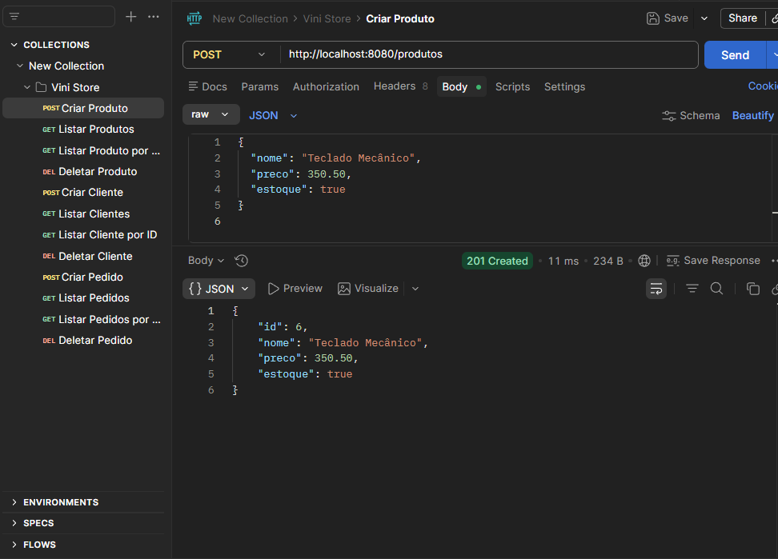
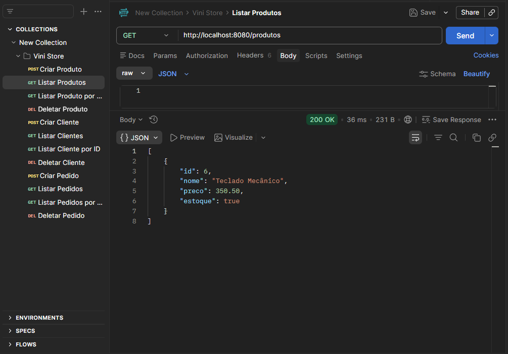
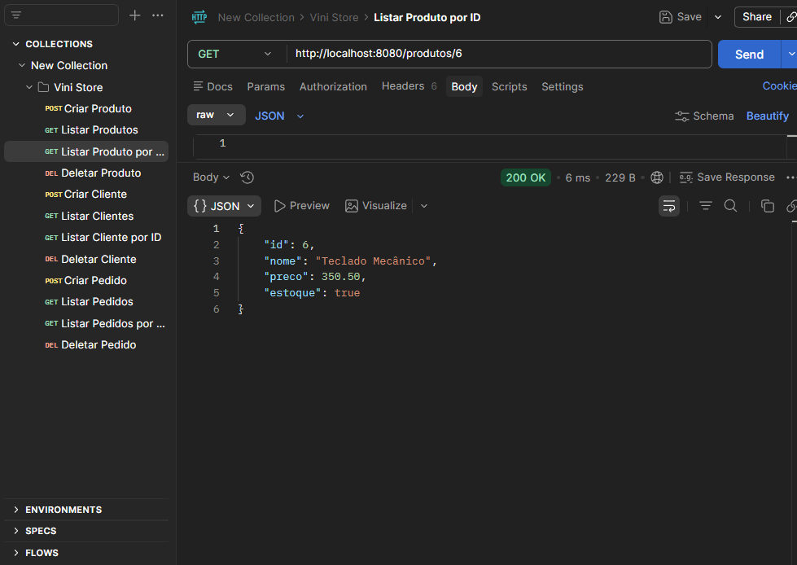
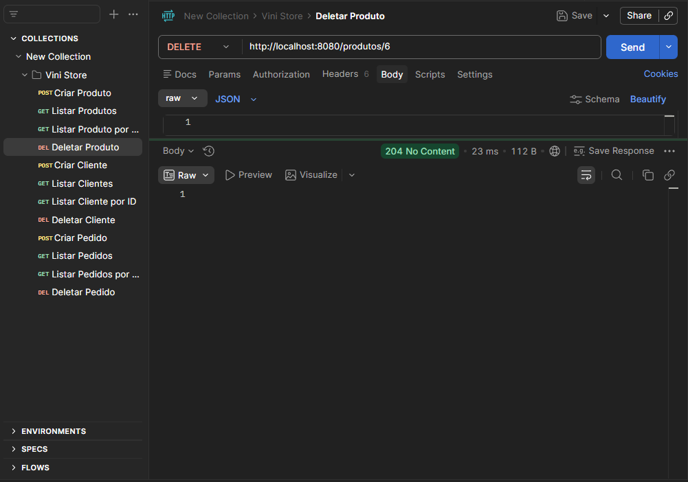

### 4.2. Funcionalidades do Cliente
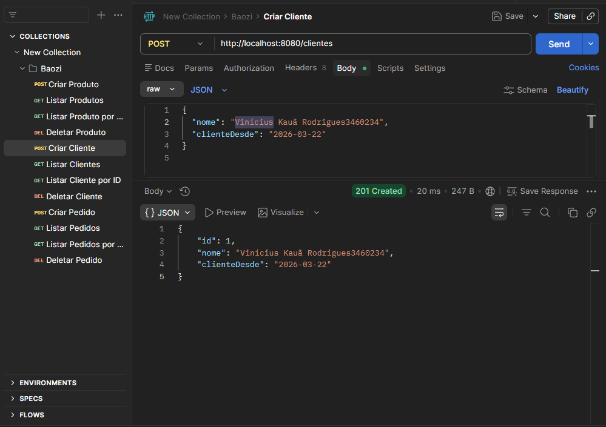
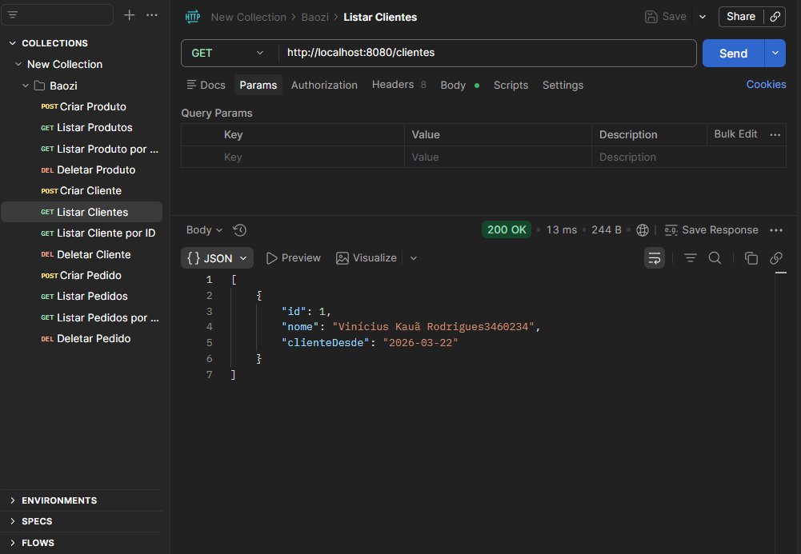
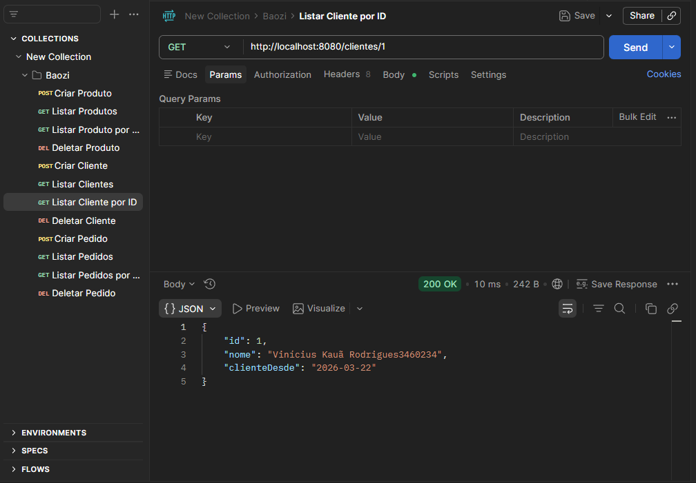
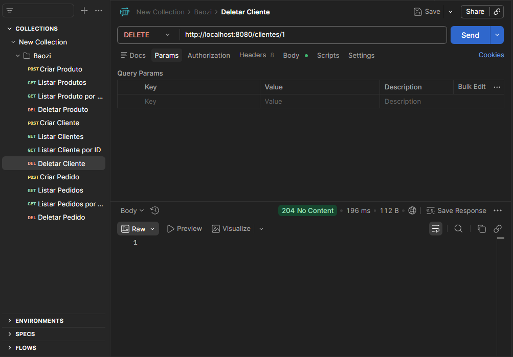

### 4.3. Funcionalidades do Pedido
*(Lembrete: Para a funcionalidade do pedido, foi executado o POST das entidades produto e cliente novamente para validar as chaves estrangeiras com a quantidade 5).*
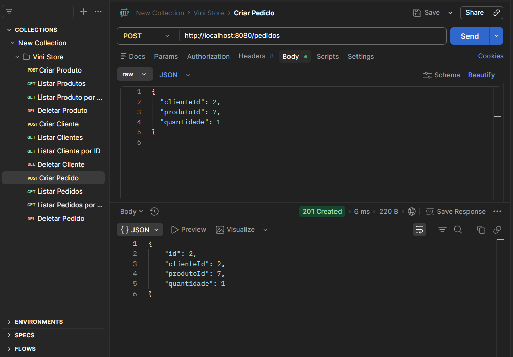
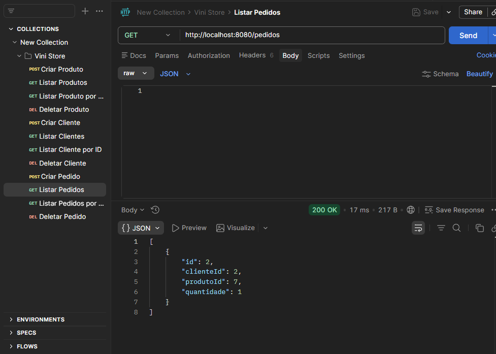
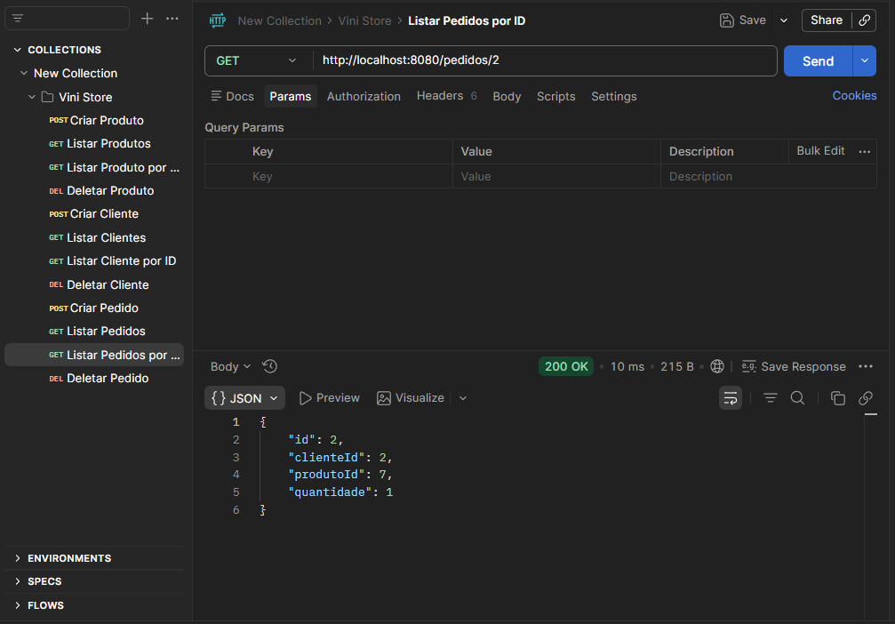
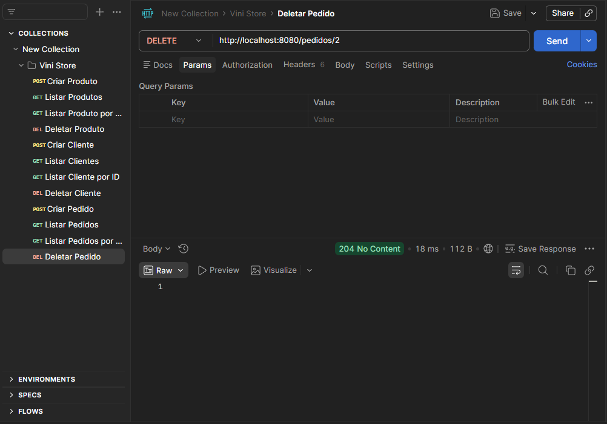
